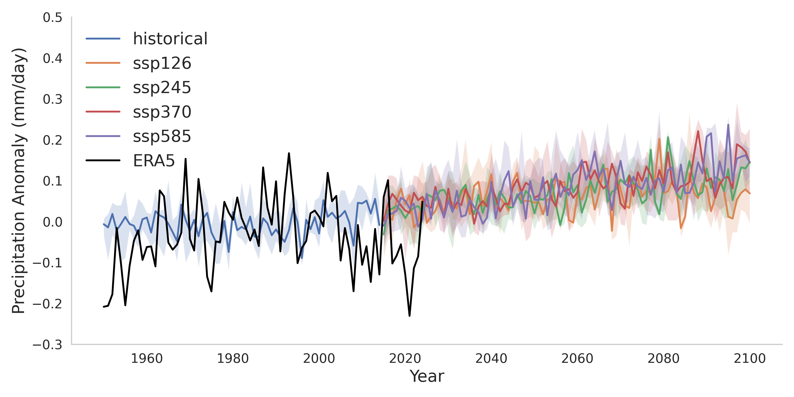
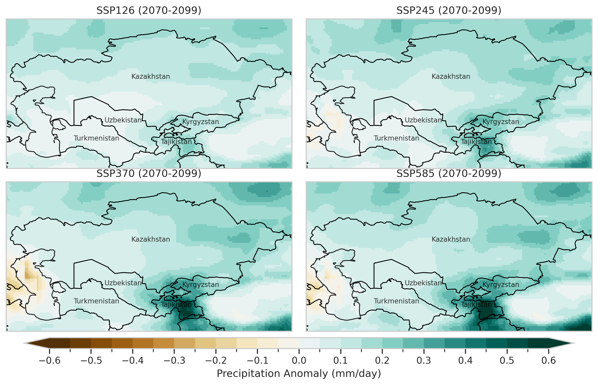
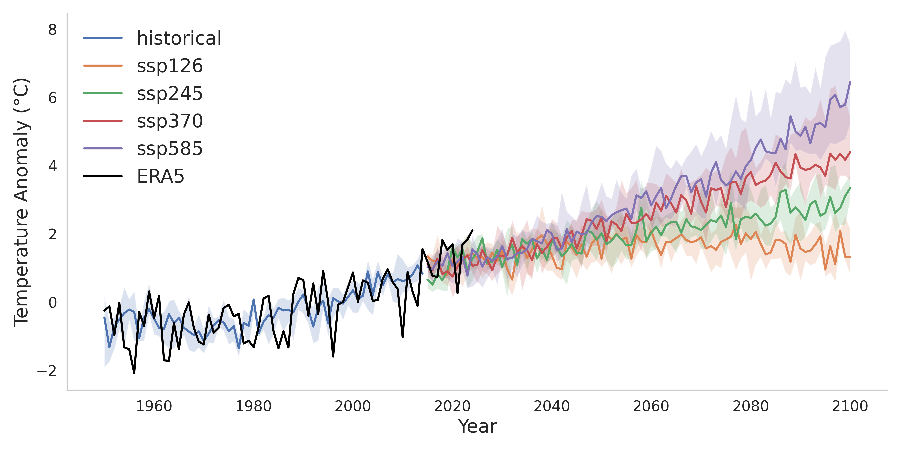
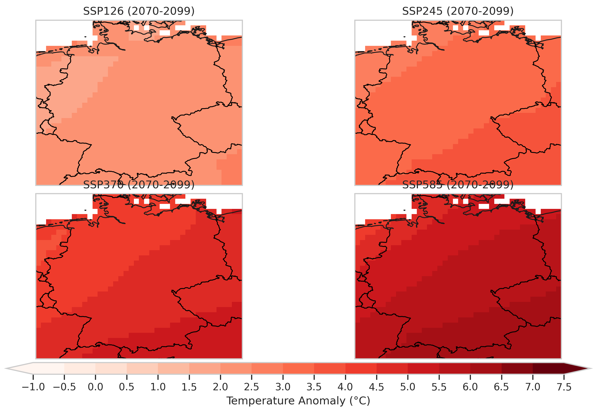

# Climate Data Processing and Analysis

This repository contains scripts and outputs for analyzing precipitation and temperature anomalies over Central Asia using climate model projections and reanalysis data. The analysis leverages data from NASA's NEX-GDDP-CMIP6, ISIMIP models, and ERA5 reanalysis datasets.

## Repository Contents

### Scripts
- **`download_er5.py`**: Downloads ERA5 reanalysis data for total precipitation from 1950 to 2024.
- **`download_nasa.py`**: Downloads NASA CMIP6 climate model data, filters for ISIMIP models, and processes yearly means.
- **`plot_advanced.py`**: Processes and visualizes precipitation and temperature anomalies from CMIP6 models and ERA5 reanalysis data.

### Figures
- 
- 
- 
- 
## Methodology

1. **Data Acquisition**
   - ERA5 reanalysis data is retrieved using `download_er5.py`.
   - NASA CMIP6 projections are downloaded using `download_nasa.py`, prioritizing ISIMIP models.

2. **Data Processing**
   - `plot_advanced.py` extracts regional data, calculates climatologies, and derives anomalies.
   - CMIP6 models are categorized into historical and SSP-based future projections.
   - ERA5 anomalies are computed relative to the 1981-2010 climatology.

3. **Visualization**
   - Ensemble means and spreads are computed for temperature and precipitation anomalies.
   - Future changes (2070-2099) are visualized using spatial anomaly maps.
   - Time series depict interannual variability and long-term trends.

## Interpretation of Figures

### **Precipitation Anomalies**
- The first figure shows historical and projected precipitation anomalies.
- Different SSPs indicate varying levels of precipitation changes, with SSP5-8.5 showing higher variability.
- The second figure provides spatial insights, highlighting wetter and drier regions under different emission scenarios.

### **Temperature Anomalies**
- The third figure illustrates warming trends over time, with SSP5-8.5 exhibiting the highest temperature rise.
- The fourth figure depicts the spatial distribution of temperature anomalies, with substantial warming across Central Asia under higher-emission scenarios.

## Dependencies
Ensure the following Python packages are installed:
```sh
pip install cdsapi cdo xarray seaborn matplotlib pandas numpy tqdm cartopy
```

## Running the Scripts
1. **Download ERA5 Data:**
   ```sh
   python download_er5.py
   ```
2. **Download NASA CMIP6 Data:**
   ```sh
   python download_nasa.py
   ```
3. **Generate Plots:**
   ```sh
   python plot_advanced.py
   ```

## Citation
If you use this repository in your research, please cite the relevant datasets:
- ERA5 Reanalysis Data: [Copernicus Climate Data Store](https://cds.climate.copernicus.eu/)
- NASA NEX-GDDP-CMIP6: [NASA Earth Exchange](https://www.nccs.nasa.gov/services/data-collections/land-based-products/nex-gddp-cmip6)

## License
This repository is open-source and provided under the MIT License.
